# 🚀 My Tools Journey  
*A beginner’s adventure into GitHub, VSCode, WSL, and running a real website*

Welcome to the story of how a simple idea — “I want a website” — turned into a full hands-on experience with professional development tools.  
This journey taught me GitHub, WSL, VSCode, and how websites actually get built and deployed.

Let’s break it down.

---

## 🗺️ Tools Journey Flowchart  
*A visual map of everything I did.*

```mermaid
flowchart TD
    A[Start: Create GitHub Account] --> B[Set Up Repository]
    B --> C[Edit Files in VSDev / VSCode]
    C --> D[Push Changes to GitHub]
    D --> E[GitHub Pages Auto-Builds Website]
    E --> F[Install WSL for Local Development]
    F --> G[Run Localhost Server]
    G --> H[Preview & Fix Code Locally]
    H --> I[Commit + Push Improvements]
    I --> J[Website Updates Live 🚀]
```



---

## 🧱 GitHub Pages — My Website Builder  

<details>
<summary><strong>Click to expand this section</strong> 🔽</summary>

<br>

GitHub Pages was the foundation of everything.

I started by:

- Creating my GitHub account  
- Making my first repository  
- Setting up GitHub Pages to host my website  
- Editing the files using VSDev.net, the online version of VSCode  

Every time I updated my code and pushed it, GitHub Pages did something magical:

👉 **It rebuilt my entire website automatically.**

This taught me:

- How version control fits into real projects  
- How updates travel from my editor → GitHub → the live website  
- That static hosting is powerful and easy once you learn the workflow  
- That each commit becomes a real change on a real website  

Seeing my changes publish instantly made everything feel real.

</details>

---

## 🐧 WSL — Turning Windows Into a Developer Machine  

<details>
<summary><strong>Click to reveal how WSL changed everything</strong> 🖥️</summary>

<br>

Developing directly on Windows can be messy, so I installed **WSL (Windows Subsystem for Linux)** — suddenly I had a full Linux system running inside Windows.

With WSL I could:

- Run Linux commands  
- Test my website locally  
- Use real development tools  
- Preview everything before uploading  

Testing locally became simple — I just opened:

```
http://localhost:4000
```

> **Milestone unlocked:** Running a real Linux development environment.

</details>

---

## 💻 VSCode — My Coding Headquarters  

<details>
<summary><strong>Click to explore my full VSCode setup</strong> 💡</summary>

<br>

VSCode quickly became the place where all the real work happened.

I used it to:

- Build my **About Me** page  
- Organize all project files  
- Install helpful extensions  
- Commit and push to GitHub  
- Write and edit this entire blog post  

Some tools I relied on:

| Tool / Feature | Why I Used It |
|----------------|---------------|
| Explorer | Organize folders & files |
| Live Preview | Instantly see Markdown changes |
| Git Panel | Commit + push to GitHub |
| Extensions | Themes, linters, Markdown tools |
| Terminal | Run Jekyll & Linux commands |

VSCode wasn’t just a text editor — it was a complete workspace.

</details>

---

## 🔗 Check Out My Website  
*(Replace with your actual site URL)*

<div style="text-align:center; margin: 20px 0;">
  <a href="https://YOUR-URL-HERE" style="
      background: #4f46e5;
      padding: 12px 22px;
      border-radius: 8px;
      color: white;
      text-decoration: none;
      font-size: 18px;
      font-weight: 600;
      box-shadow: 0 4px 10px rgba(0,0,0,0.15);
      transition: 0.2s;
  "
  onmouseover="this.style.background='#4338ca'"
  onmouseout="this.style.background='#4f46e5'">
    🌐 Visit My Website
  </a>
</div>

---

## 🌟 Final Thoughts  

This wasn’t just a school task — it was my introduction to real development.

By the end, I had:

- Built and updated a real website  
- Learned version control  
- Used GitHub Pages for deployment  
- Installed and used WSL like a real developer  
- Built locally using Jekyll  
- Worked daily inside VSCode  

And all of it connected together into one smooth workflow.

**More tools. More coding. More building.  
Onward. 🚀**


